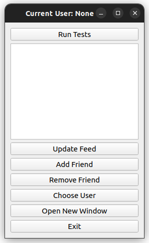

# 🌐 USocial - A Basic Social Media System in C++

USocial is a basic social media system simulation written in C++. It offers a suite of functionalities that mirror core features of popular social media platforms. This project allows users to engage in typical social media activities, from posting text and multimedia 📸🎥🎵 to adding friends 👫 and exchanging messages ✉️.

Originally conceived as a coursework project for the *Open University of Israel* course *"Defensive System-Programming (20937)"*, it now serves a dual role, also being a part of a job application portfolio for students.

<p align="center">
  
</p>

---

📚 **Table of Contents**

<!-- @import "[TOC]" {cmd="toc" depthFrom=2 depthTo=6 orderedList=false} -->

<!-- code_chunk_output -->

- [🔧 Technologies Used](#-technologies-used)
- [🌟 Features](#-features)
  - [🌐 USocial](#-usocial)
  - [👤 User](#-user)
  - [📁 Media](#-media)
  - [📌 Post](#-post)
  - [💬 Message](#-message)
- [⚙️ Compilation and Usage](#️-compilation-and-usage)
  - [New Qt GUI](#new-qt-gui)
- [🎥 Sample Execution](#-sample-execution)
- [👥 Contributing](#-contributing)
- [📜 License](#-license)
- [📬 Contact](#-contact)

<!-- /code_chunk_output -->

---

## 🔧 Technologies Used

- **C++**: The primary language used, incorporating C++14 features.

- **Smart Pointers**: Usage of `std::shared_ptr` and `std::weak_ptr` to manage resources efficiently and prevent memory leaks.

- **Standard Library Containers**: Leveraged `std::map` and `std::list` for data storage and management.

- **Exception Handling**: Integrated throughout for handling potential error scenarios.

- **Object-Oriented Principles**: The architecture is built upon principles like inheritance and polymorphism.

## 🌟 Features

### 🌐 USocial

- Acts as a hub for user management.
- Facilitates user registration, with options for standard or business status.
- Allows user removal from the system.
- Provides user retrieval functionality via ID.
- Offers a display of all users, primarily for debugging purposes.

### 👤 User

- Users can create posts with text and multimedia content.
- Provides capabilities to add or remove friends.
- Enables users to view posts from their friends.
- Facilitates the sending and receiving of messages.
- Business users get the added perk of broadcasting messages to multiple users simultaneously.

### 📁 Media

- An abstract base class for various media types.
- Currently supports Photo 📸, Audio 🎵, and Video 🎥 subclasses.
- Each media type has a unique method to showcase its content.

### 📌 Post

- Symbolizes user-generated content that may be a blend of text and media.

### 💬 Message

- Denotes the exchange of messages between users, be it text or media.

---

## ⚙️ Compilation and Usage

### New Qt GUI

The project now includes a new Qt GUI, which is the recommended way to interact with the system. To launch the GUI, please make sure you have Qt Creator installed, then open the project file `project.pro` and run the project.

---

A `Makefile` is included to streamline the build process. To set the system in motion, adhere to the following sequence:

```bash
make clean
```

## 🎥 Sample Execution

You can run an example test py pressing `Run Test` from the Qt GUI.

 |  |
:-------------------------:|:-------------------------:|

A new window will be promped when the test is done. You can see the results of the test in the console Real-time.

<p align="center">
  
</p>

A preconfigured main function offers a walkthrough of the USocial system's multifaceted features. This includes registering users, crafting posts, forging friendships, initiating message exchanges, and simulating potential error scenarios (e.g., repetitive friend additions or sending messages to non-friends).

## 👥 Contributing

Contributions are heartily welcomed. Start by forking the project, instate your modifications, and initiate a pull request.

## 📜 License

USocial is distributed under the MIT License.

## 📬 Contact

Feedback, suggestions, or inquiries? Please direct them to [email](mailto:dor.pascal@gmail.com).
